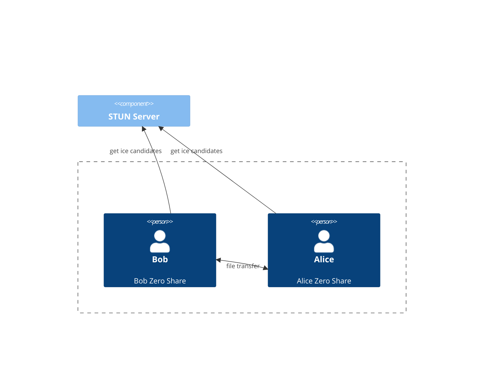
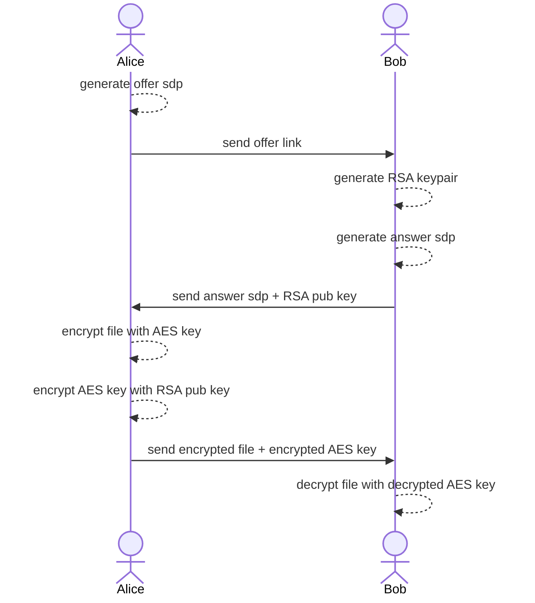

# Secure share

[](https://github.com/iAdityaNarayanT/secure-share)
[]()

A client-side secure P2P file sharing using WebRTC.

## Features

- Send multiple files in parallel.
- Generate SDP connection for WebRTC data channel.
- No server side (only use public STUN servers for ICE candidates).
- PGP Encryption.
- Responsive UI.
- Open-source license.
- QR Scan for SDP trade.
- Paste from the clipboard.

## Usage

1. The offer goes to <https://secure-share.github.io/>.
2. The offer generates an offer link and then sends it to the answer.
3. The answer opens the offer link and then sends it to the offer.
4. The offer paste the answer code then click `Accept Answer`.
5. The offer/answer can now select and send files.

[example.webm](https://user-images.githubusercontent.com/8283616/234210465-7b20ad8d-9b1b-413b-ac4e-3919f9261b8e.webm)

## How does it work?

Zero share client will get ICE Candidate from STUN/TURN server and make a connections between peers.

Thanks to the Interactive Connectivity Establishment (ICE) protocol, Two peers will have the shortest path to travel between them without caring the Network address translation (NAT).

WebRTC protocol will secure by DTLS (Datagram Transport Layer Security) But DTLS can be vulnerable to man-in-the-middle (MITM), So we provide a second layer encryption using PGP (RSA-OAEP-1024, AES-128).



Example sequence, Alice want to send a file to Bob.



## Development

Requirements

- Node (^16.14 || >=18)
- NPM

Installation

```sh
npm install
```

Run development (hot reload)

```sh
npm run dev
```

Test (playwright)

```sh
npm run test
```

## Deployment

For self-host, you can run `npm run build` to build the static files. This no need the server side of svelte.

## Known Issues

1. Sometimes your internet will block the Google public STUN server and it may slow. I recommend to try to use a different STUN server, can check the list [here](https://github.com/pradt2/always-online-stun/blob/master/valid_hosts.txt).
2. Sometimes gets blocked by the firewall during sending files.
